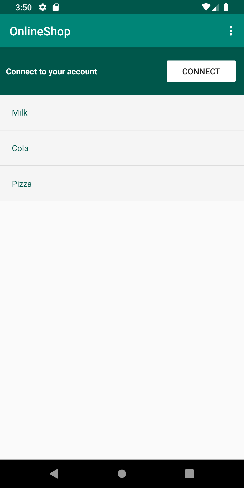
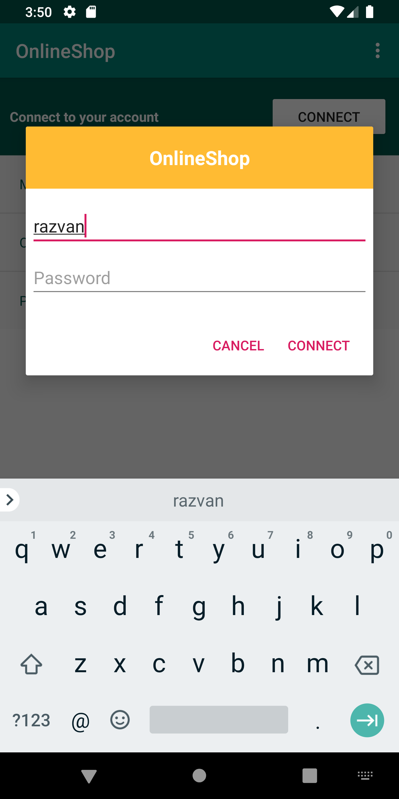
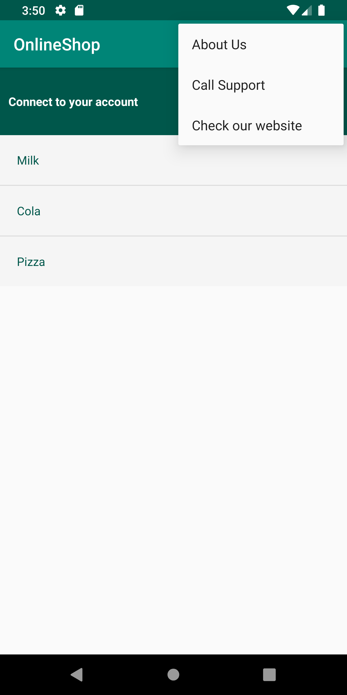

# fii-android

# Projects for the Android course 2019-2020 (UAIC Cuza 2020, Faculty Of Computer Science)

#### Collection

[1. L1, L2, L3](###L1-L2-L3)  
[2. L4](###L4)
[3. L5](###L5)

---

## L1-L2-L3

**Task**

```
    1. Project setup
    2. Activity Lifecycles
    3. ...
```

## L4

**Task**

```
    1. Implement functionalities for the menu you created in Lab 3 (2p)
    2. Create another Activity (or more) and connect them using Intent Filters. ( i.e. intents for sending a SMS, starting a voice call, open an URL, etc.) (2p)
    3. Use dialog windows (AlertDialog) to interact with the user (username, password, search filter, etc.) (2p)
```

| Main Activity                        | Connect Dialog                           | Options Menu (w/ Intents)           |
| ------------------------------------ | ---------------------------------------- | ----------------------------------- |
|  |  |  |

The Options Menu includes 3 actions with the following intents:

1. Intent to the 'About Activity'
2. Intent to the Dial Screen
3. Intent to the Browser (with attached website)

---

## L5

```
    1. Settings Activity (4p)
    2. Shared Preferences implementation (4p)
```
