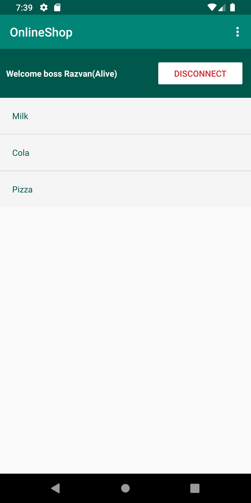

# fii-android

# Projects for the Android course 2019-2020 (UAIC Cuza 2020, Faculty Of Computer Science)

## Final Project (White Tiles / Van Tiles)

**Task**

```
    1. Implement an app similar to 'Don't touch the White Tiles' / 'Piano Tiles' (in pure Android)
    2. Implement extra features such as local Leaderboards or social-share intents
```

**Exact Project Description**

WhiteTile - The game consists of a grid in which there are white/black tiles coming from the top of the screen to the bottom with an increasing speed. The goal of the game is to touch only the black tiles(which should make a sound). Menu with highscores, share on facebook, new game.

**Preview**

[](https://youtu.be/l8t8maEjppU)

[The APK is located at the root of this repositoy](van-tiles-app.apk).

## Labs

#### Collection

[1. L1, L2, L3](#L1-L2-L3)  
[2. L4](#L4)  
[3. L5](#L5)  
[4. L6](#L6)

---

## L1-L2-L3

**Task**

```
    1. Project setup
    2. Activity Lifecycles
    3. ...
```

## L4

**Task**

```
    1. Implement functionalities for the menu you created in Lab 3 (2p)
    2. Create another Activity (or more) and connect them using Intent Filters. ( i.e. intents for sending a SMS, starting a voice call, open an URL, etc.) (2p)
    3. Use dialog windows (AlertDialog) to interact with the user (username, password, search filter, etc.) (2p)
```

| Main Activity                        | Connect Dialog                           | Options Menu (w/ Intents)           |
| ------------------------------------ | ---------------------------------------- | ----------------------------------- |
|  |  |  |

The Options Menu includes 3 actions with the following intents:

1. Intent to the 'About Activity'
2. Intent to the Dial Screen
3. Intent to the Browser (with attached website)

---

## L5

**Task**

```
    1. Settings Activity (4p)
    2. Shared Preferences implementation (4p)
```

| Main Activity                        | Create Product                       | Settings Activity                            | Settings Pref                                 |
| ------------------------------------ | ------------------------------------ | -------------------------------------------- | --------------------------------------------- |
|  |  |  |  |

**Story**

1. Implemented Shared Pref system for user connect/disconnect
2. Migrated to androidX
3. Implemented `PreferenceScreen` system
4. Connected settings preferences to other parts of the app (`Main Screen`)
5. Used local storage (internal) to save the list of items/products
6. Provided a way (dialog) to create items or clear the list (pref settings)

## L6

**Task**

```
    1. Sensor Manager (4p)
    2. Location Services (4p)
```

| Sensor Activity                           | (Geo)Location Activity                       |
| ----------------------------------------- | -------------------------------------------- |
|  |  |

**Story**

1. Implemented a SensorEventListener and configured `accelerometer, gravity, pressure and proximity`
2. Implemented a location listener (with checks for permissions) and converted the result into a readable address
